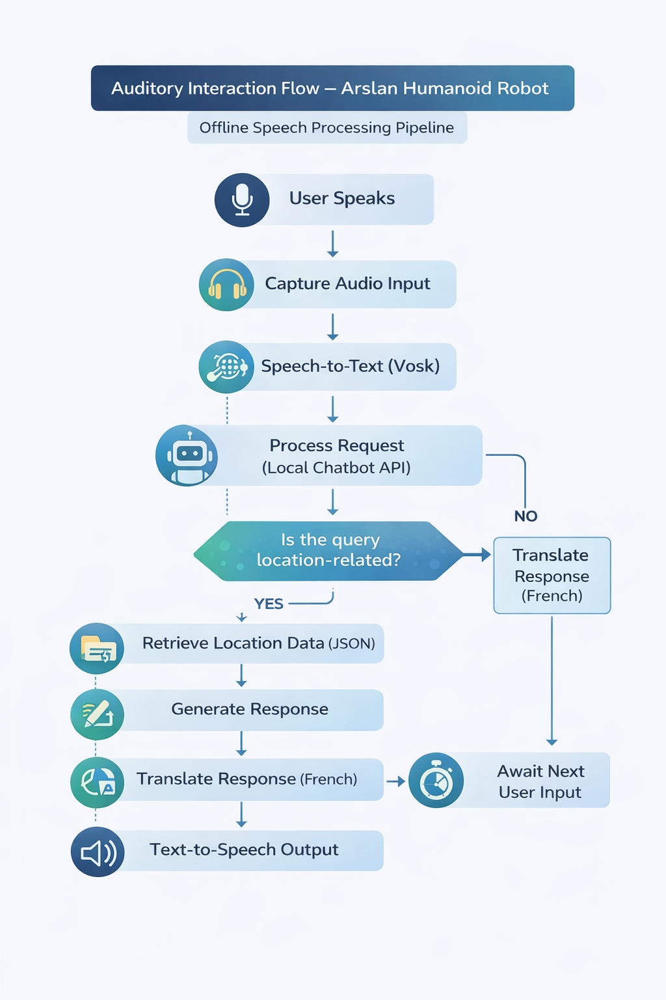
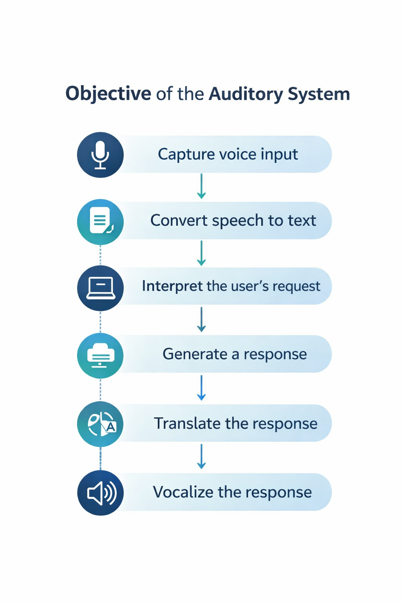

# Auditory System Diagrams

This section presents the main diagrams illustrating the design and workflow
of the Arslan Auditory Interaction System.

## Auditory Interaction Flow

This diagram shows the complete pipeline from user speech input to audio response.

## Auditory System Objectives

This diagram summarizes the primary goals of the auditory subsystem, including:
- Offline speech recognition
- Multilingual interaction
- Reduced response latency
- Compatibility with constrained development environments
