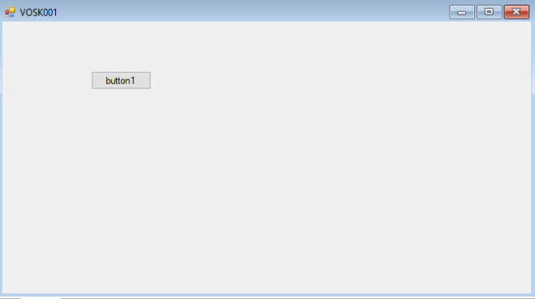

# Screenshots – Auditory Interaction Demo

This section visually documents the auditory interaction capabilities of the **Arslan humanoid robot prototype**.

---

## 1. Console-Based Auditory Interaction

This screenshot shows the **core auditory pipeline running locally**:

- Microphone input captured from the user
- Speech transcribed to text using offline speech recognition (Vosk)
- Contextual response generated by Arslan
- Example interaction: locating the nearest hospital and giving directions

This demonstrates real-time speech understanding and response generation without internet dependency.

---

## 2. WinForms Control Interface

This screenshot shows the **minimal WinForms graphical interface** developed under **SharpDevelop**:

- Used to trigger and manage the auditory interaction
- Acts as a lightweight control layer for the system
- Designed intentionally simple due to IDE and project constraints

---

### Notes
- Source code, external libraries, and DLL dependencies are intentionally excluded
- Screenshots are provided for demonstration and documentation purposes only
